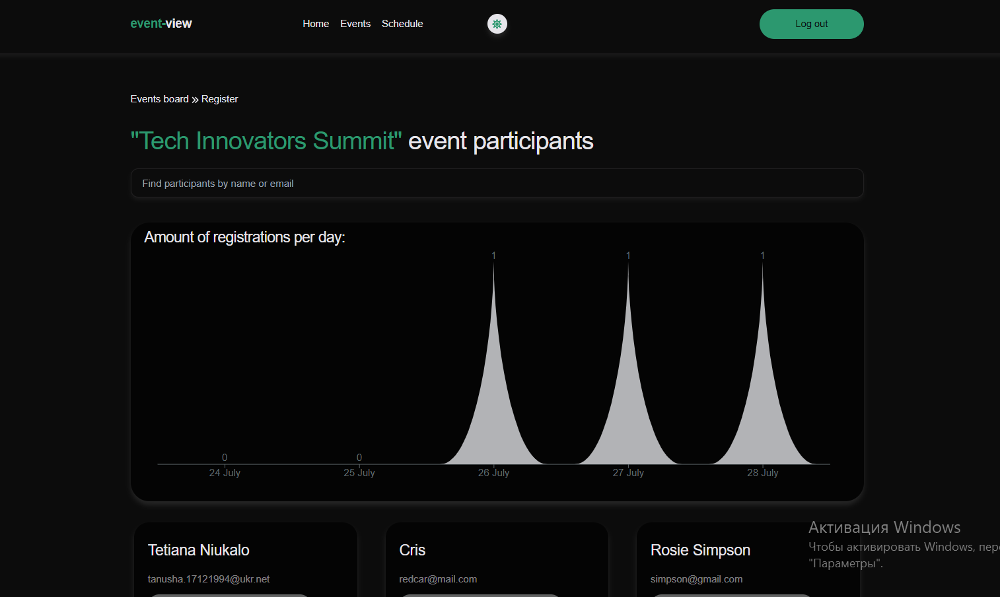
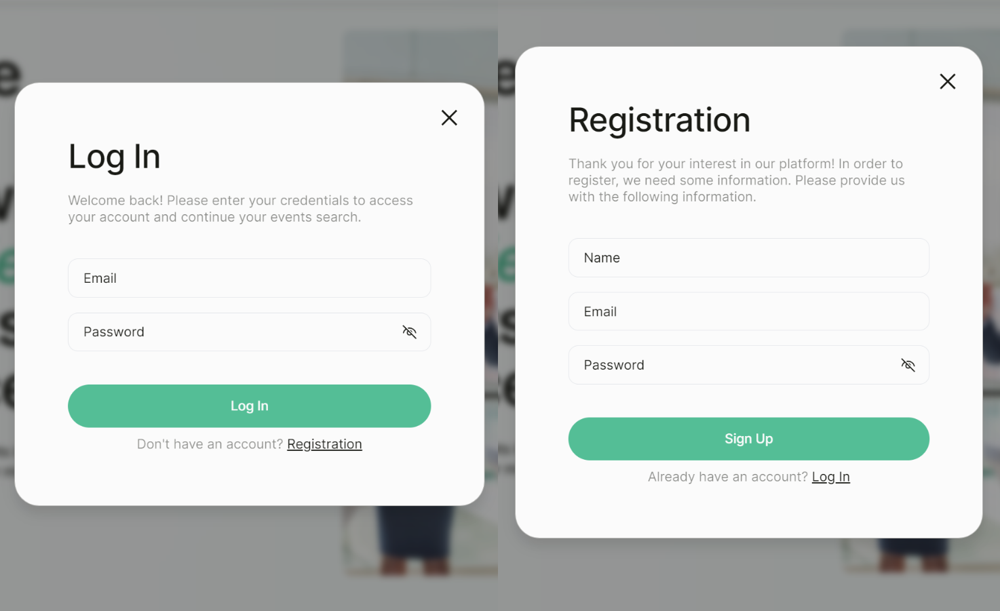

# Event-View

"Event-View" is a dynamic and user-friendly web application designed to help users discover, register for, and manage events. It offers a seamless experience with user authentication, responsive design, and interactive features to ensure that users can easily find and participate in events of interest.

### Pages

**1. Home**

- Welcomes users with a site title, company slogan, and a call-to-action button redirecting to the "Events" page.

**2. Events**

- Each event card includes essential details, a "Register" button for users to sign up for the event, and a "View" button to see who has registered for that event.
- Detailed information about each event is available, including the event title, date, description, and organizer.
- Supports sorting of events by date (newest/oldest), title (A-Z/Z-A), and organizer (A-Z/Z-A).
- Implements infinite scrolling to load events dynamically as the user scrolls down the page.

**Registration page**:

- Provides a user-friendly form for event registration.
- Form validation ensures accurate and complete user input.

**Participants page**:

- Allows users to view a list of registered participants for each event.
- Enables search by full name or email for easy navigation.
- Presents bar charts showing registrations per last week, offering insights into event popularity trends.

  

**3. Schedule**

- Private page accessible to authenticated users.
- Displays a schedule of all events the user has registered for.

## Features

- **User Authentication**: Secure login, registration, and logout functionalities powered by Node.js.
- **Adaptive Design**: Fluid layout for breakpoints at 320px, 375px, 768px, and 1440px. Ensures compatibility and usability across various devices.
- **Modal Dialogs**: Enhanced interaction through modal dialogs for login, registration, and scheduling.
- **Form Validation**: Implemented using React Hook Form and Yup for client-side validation.
- **Dark/Light Mode Toggle**: Switch between light and dark themes for a comfortable viewing experience in different lighting conditions.

 

## Technologies Used

## Deployment

- This project is deployed on Vercel. Check it out: [**Event-View**](https://event-view.vercel.app/)
- Here you can see back-end part of website: [**Event-View backend**](https://event-view.vercel.app/)

Experience a seamless way to manage your events with "Event-View," your go-to platform for discovering and registering for exciting events.
